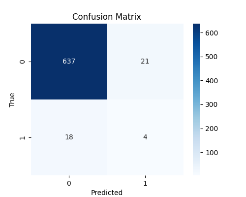
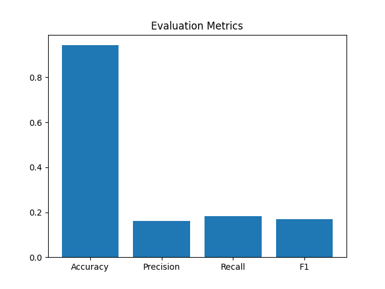

# 📄 Türkçe Coreference Resolution Sistemi

## İstatistiksel Makine Öğrenmesi Tabanlı NLP Projesi
### Tuğba Nur Ayık -- Bilgenur Çakır
---

## 🧠 Proje Genel Bakış

Bu proje, Türkçe metinlerde **coreference resolution (gönderim çözümleme)** işlemini **istatistiksel makine öğrenmesi yaklaşımıyla** gerçekleştirmeyi amaçlamaktadır.

Coreference resolution, bir metinde farklı kelime veya ifadelerin aynı varlığa referans verip vermediğini belirleme görevidir.

Örnek:

> Ahmet kitabı aldı. O okumaya başladı.

Burada **“O” → “Ahmet”** anlamına gelir.

---

## 🎯 Amaç

Bu projenin temel amaçları şunlardır:

* Türkçe metinlerde coreference ilişkilerini tespit etmek
* Veriyi **CoNLL formatında temsil etmek**
* İstatistiksel bir makine öğrenmesi modeli eğitmek
* Performansı standart NLP metrikleri ile değerlendirmek
* BIO etiketli çıktı ve küme tabanlı varlık zincirleri üretmek

---

## 📂 Veri Seti Formatı (CoNLL)

Veri seti **CoNLL formatında** etiketlenmiştir:

```
token_id   kelime   etiket
```

Örnek:

```
1   Ahmet   B-1
2   kitabı  I-1
3   raftan  O
```

### Etiket Açıklaması:

* **B-X** → Coreference kümesinin başlangıcı
* **I-X** → Coreference kümesinin içi
* **O** → Coreference ilişkisi yok

---

## ⚙️ Sistem Pipeline (İş Akışı)

Sistem aşağıdaki adımlardan oluşur:

### 1. Veri Yükleme

* CoNLL formatındaki dosyaları okur
* Dokümanları token dizilerine böler

### 2. Özellik Çıkarımı

Her kelime çifti için:

* Küçük/büyük harf eşitliği
* Büyük harf benzerliği
* Alt string (substring) benzerliği

---

### 3. Çift Bazlı Sınıflandırma

Her kelime çifti şu şekilde sınıflandırılır:

* `1` → Coreference ilişkisi var
* `0` → Coreference yok

---

### 4. Model Eğitimi

* Logistic Regression sınıflandırıcı kullanılır
* `class_weight="balanced"` ile dengesizlik giderilir

---

### 5. Kümeleme (Clustering)

* Union-Find algoritması kullanılır
* Kelimeler coreference zincirlerine gruplanır

---

### 6. BIO Etiketleme

* Küme yapısı CoNLL BIO formatına dönüştürülür

---

## 🤖 Makine Öğrenmesi Modeli

* Algoritma: **Logistic Regression**
* Kütüphane: `scikit-learn`
* max_iter: 1000
* class_weight: balanced

---

## 📊 Değerlendirme Metrikleri

Model şu metriklerle değerlendirilir:

* Accuracy (Doğruluk)
* Precision (Kesinlik)
* Recall (Duyarlılık)
* F1-score
* Confusion Matrix

---

## 📉 Sonuçlar

### 🔹 Sayısal Sonuçlar

```
Accuracy: 0.94
Precision: 0.16
Recall: 0.18
F1-score: 0.17
```


## 📌 Sonuçların Yorumu

Sistem **yüksek accuracy (~0.94)** değerine ulaşmasına rağmen, **coreference sınıfındaki performans düşüktür**.

### Neden?

---

### ⚠️ 1. Sınıf Dengesizliği

* Coreference olmayan (0): ~658 örnek
* Coreference olan (1): ~22 örnek

➡ Model çoğunluk sınıfa eğilimlidir

---

### ⚠️ 2. Sınırlı Özellik Temsili

Kullanılan özellikler:

* Yüzeysel eşleşmeler
* Semantik embedding yok
* Bağlamsal anlam bilgisi yok

---

### ⚠️ 3. Model Sınırlılığı

* Logistic Regression lineer bir modeldir
* Derin anlamsal ilişkileri yakalayamaz

---

## 📌 Çıktı Formatı

Sistem CoNLL formatında çıktı üretir:

```
results/final.conll
```

Örnek:

```
1   Ahmet   B-1
2   kitabı  I-1
6   O       I-1
```

---

## 📁 Proje Yapısı

```
src/
│── main.py

data/
│── train.conll
│── test.conll

results/
│── final.conll
│── confusion_matrix.png
│── metrics.png
```

---

## 🚀 Çalıştırma

```bash
python src/main.py
```

---

## 📌 Sınırlamalar

* Veri seti oldukça dengesiz
* Semantik embedding yok (örn. BERT)
* Pairwise model global bağlamı dikkate almıyor
* Kümeleme yaklaşımı basit

---

## 🔮 Gelecek Çalışmalar

* 🔥 BERT / Sentence Transformer embeddingleri
* 🧠 CRF tabanlı sequence labeling
* 📊 Azınlık sınıf için veri artırma
* 🌐 Span tabanlı neural coreference modelleri
* 📈 Graph tabanlı kümeleme yöntemleri

---

## 🧾 Sonuç

Bu proje, Türkçe metinler için **temel bir istatistiksel coreference resolution sistemi** sunmaktadır.

Sistem uçtan uca çalışsa da performans şu nedenlerle sınırlıdır:

* Veri dengesizliği
* Semantik özellik eksikliği
* Lineer model kullanımı

Buna rağmen sistem, tam bir NLP pipeline’ını başarıyla göstermektedir.

---

## 📷 Görseller (Otomatik Üretilen)

### Confusion Matrix



### Değerlendirme Metrikleri



